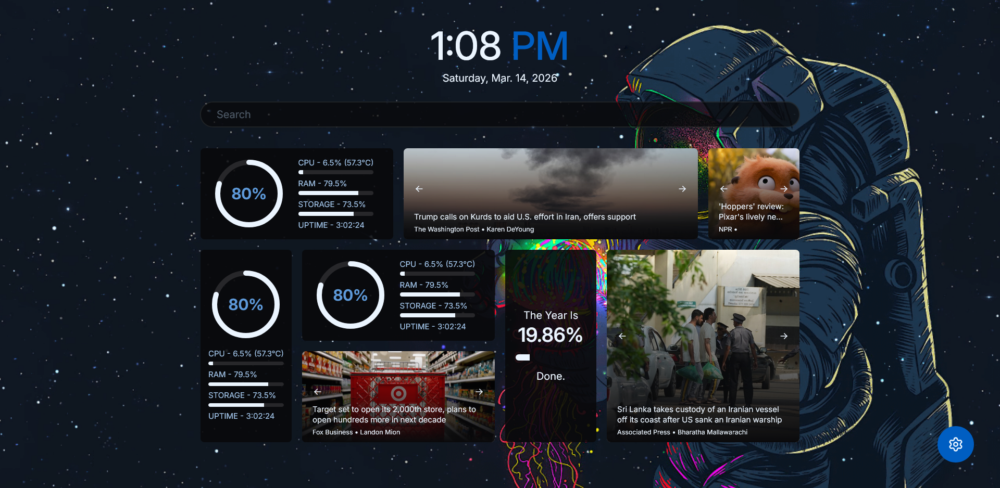

> [!NOTE]
> If you think you've seen this project before, there's a good chance you probably have. The only MAJOR thing that has been updated is to allow people to be able to experience the project better (There were quite a few that missed core features). If you also want to actually follow this development, switch to either the main branch or the ai branch (ai branch is written mostly by ai)

# SolidJS Homepage

A simple, fully customizable homepage with widgets that saves entirely locally to localStorage. Written in SolidJS utilizing SolidStart.   

### Core Features 

List of features (Since I did not market this enough last time)
- Customized search bar with prefix based searching (Prefixes can modify the end url destination)
    - `Ctrl + Enter` to open the search to a new window
    - Change the default search engine
    - Add/remove search prefixes in settings menu. 
- Widget support to make your homepage more useful. Both resizable and repositionable. Current widgets include
    - Time Progress (How much of the year has been completed)
    - System Info (Info about your system)
    - News Widget (See whats going on in the world)
- Custom CSS. Open settings and modify the site's look to your hearts content
- Customizable background image. 
- Dark/light/system mode. Defaults to system
- Saved entirely to localStorage. No data leaves your laptop (Hopefully)
- Export all of your data/settings to a json file and be able to import it all right back. 

Open the settings menu using `Ctrl + Period` to find all the customization. 

Don't like a feature or widget? Want to add something new? Fork the repo and do it yourself. 

### Example


An example of what it could look like. [Link](https://pastebin.com/uT1Ah0XS) to its setting.json file. 
### Development

Clone the repo, install the packages and run the development server 

```bash
npm i
npm run dev
```

and it view on [http://localhost:3000](http://localhost:3000)